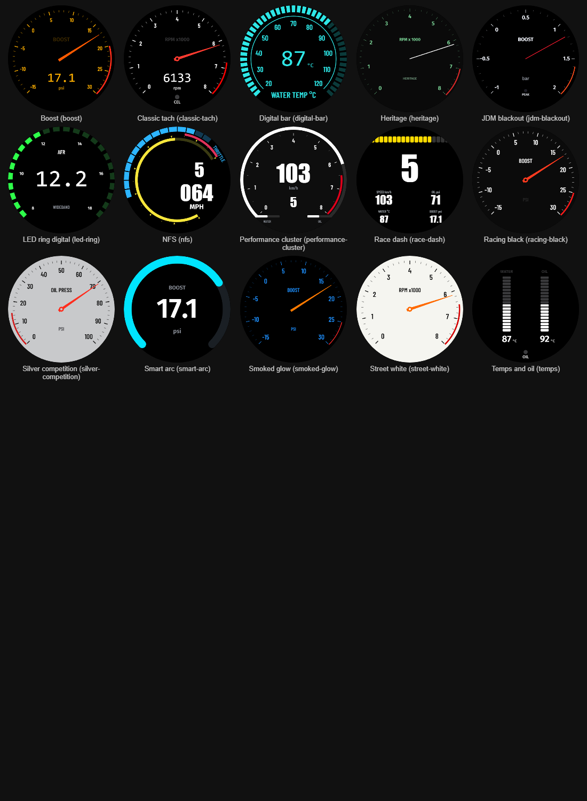

# Starter templates

The hub carries these configs in its firmware. In the web UI's Configs tab, pick one in
the template dropdown, press **New from template**, change what you like and **Save**;
the copy in the library is yours to edit, the template itself never changes. Every
template is a plain config (`docs/config-schema.md`), so anything in it can be changed
in the Widget styles panel or in the JSON.

Ten of them reproduce the gauge looks that sell or get copied the most, from aftermarket
catalogues, OEM clusters and community display projects. They are written by
`scripts/gen_templates.py`; edit the style there and run it again rather than editing
those ten JSON files by hand.

| Template | Look | Faces |
|---|---|---|
| `racing-black` Racing black | The default aftermarket gauge: matte black face, white condensed numerals, red tapered pointer with a hub cap, 270 degree sweep, red redline band, unit under the hub. The look of the classic black racing dials from the big US gauge makers. | Boost, Oil pressure, Water temp, Tach |
| `smoked-glow` Smoked glow | Blacked-out dial that glows in colour when lit: blue numerals and ticks, orange pointer, a thin red redline arc and a flashing warning dot. The look of the colour-selectable 52 mm gauges that top the online best-seller lists. Change the `fg` colour in the theme for another glow colour. | Boost, Oil pressure, Trans temp |
| `led-ring` LED ring digital | Big 7-segment number in the middle, a ring of 24 discrete green LEDs round the rim, small scale labels, name at the top and unit at the bottom. The wideband-controller look, cloned by many digital boost gauges. | AFR, Boost, Oil pressure, Oil temp |
| `jdm-blackout` JDM blackout | Pure black face with thin modern white numerals, a thin red needle on a small hub, metric scales (bar, degrees C) and small peak and warning dots. The reference JDM gauge style. | Boost, Oil temp, Water temp, Tach |
| `race-dash` Race dash | A race display rather than a dial: RPM bar across the top in green, yellow and red, a huge gear digit, then speed and the vital channels as numbers under small grey captions, flashing red on alarm. | Sprint, Endurance |
| `performance-cluster` Performance cluster | OEM performance-mode cluster: one dominant tach ring with the redline in red, thin ticks, big digital speed and gear in the centre, and two small bars for temperatures or boost and oil. | Sport, Track |
| `silver-competition` Silver competition | Satin-silver face with black numerals and ticks and a red tapered pointer; the drag and circle-track dash look. | Oil pressure, Water temp, Volts, Boost |
| `smart-arc` Smart arc | Flat modern display: a thick rounded cyan arc, a huge centred number, small grey caption above and unit below. The arc turns amber or red at the limit. The look of most round-display DIY projects and plug-in OBD gauges. | Boost, Coolant, Battery, Oil pressure |
| `street-white` Street white | Off-white face, bold black condensed numerals, orange tapered pointer with a hub, red redline. The main alternative to black in every catalogue. | Tach, Oil pressure, Water temp, Volts |
| `heritage` Heritage | Classic-car instruments: a black tach with green print and a thin white needle in the style of early Porsche, and cream short-sweep (120 degree) small gauges with black print in the style of British classics. | Tach, Oil pressure, Water temp |
| `classic-tach` Classic tach | A white-on-black needle tach with a digital RPM readout, check-engine light and a shift rim, plus a segmented boost ring face. The first template, used in the bring-up checks. | Tach, Boost |
| `digital-bar` Digital bar | The 52 mm LCD gauge look: a cyan segmented bar round the rim, a thin inner arc with labels, 7-segment digits with the unit beside them, a warning caption and a title at the bottom. | Water temp, Oil pressure, Boost |
| `nfs` NFS | Game-style cluster: a segmented blue throttle arc with a rotated tab label, yellow rev arc with triangle markers and a red redline band, gear letter and a zero-padded speed. The cartoon in the original is a bitmap, which configs cannot carry yet. | Street, Track |
| `boost` Boost | Boost-only faces. | 2 |
| `temps` Temps and oil | Temperature and oil pressure faces. | 2 |

## Changing what a template shows

Every arc, bar and number is bound to one Haltech channel. In the Widget styles panel
under the preview, each widget has a channel dropdown (every channel the hub decodes), a
unit dropdown for channels with more than one unit, and its range, so a boost face
becomes an oil-pressure face by changing three fields. The theme colours sit at the top
of the JSON as six roles (`bg`, `fg`, `accent`, `dim`, `warn`, `alert`); changing one
changes every widget that uses that role.

## What the styles cannot do yet

- No bitmaps: logos, cartoons and background images are not part of the config format.
- No true italic text: the gauge draws from the eight bundled font files. Racing Sans One
  is slanted by design, which covers most of that need.
- No icons: the oil-can or temperature symbols on some gauges are drawn as text labels.
- Gradients along an arc are drawn as a solid colour; zones give a colour change at a
  value instead.
